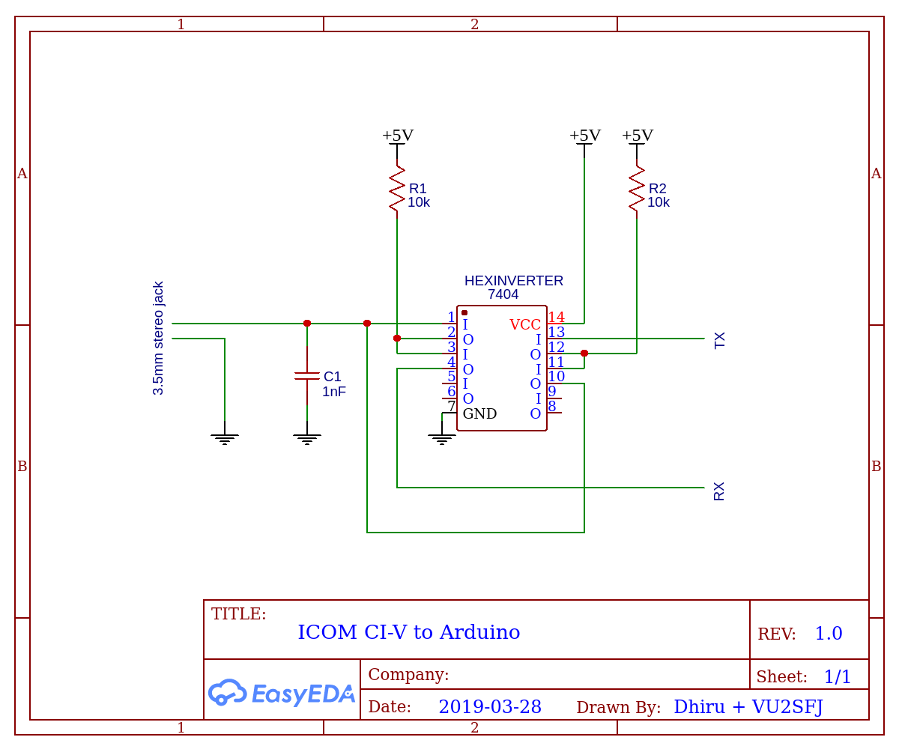

### Easy-ICOM-CI-V

This project supports interfacing of Arduino with ICOM rigs using the CI-V
interface easily. It supports bi-directional communications in half-duplex
mode.

This design is borrowed from the https://buildthings.wordpress.com and
https://www.qsl.net/g3vgr/civ.html (G3VGR) websites.

Note: Alternatively, you can get a `CI-V Cat Interface Cable For CT-17` from
AliExpress for under 5 USD for connecting a PC to the radio via USB. Search for
`USB CI-V` on AliExpress. We haven't tested these though.

This project has been tested with following ICOM radios:

- ICOM IC-706MKIIG

#### BOM

Note: All these components are easily available online (Semikart and others).

* 1 * Small general purpose PCB ("perf board")

* 1 * 7404 hex-inverter IC (DIP-14 package, SN74HC04N / SN74HC04 / 74HC04N / 74HC04) - can get 74LS04 also

* 1 * DIP-14 IC socket/holder (optional)

* 1 * DIP-6 IC socket/holder (optional)

* 2 * 10K 1/4 W metal film resistor

* 1 * 0.001uF (1nF) ceramic disk capacitor

* 1 * 3.5mm (1/8") Male to Male Stereo Audio Aux Cable (3.5mm TRS Male to 3.5mm TRS Male)

* 1 * 3.5mm (1/8") Audio Jack PCB Mount Female Socket for Stereo

* Arduino Nano or Arduino Uno Rev3 / ATmega328-PU chip + 16 MHz crystal + 10k resistor + 2 * 22pF ceramic capacitors

#### Schematic

Note: Connect `Pin 1 (and Pin 10)` to the `Tip` of the stereo TRS 3.5mm (1.8")
socket/plug. Connect GND to the `Sleeve` of the 3.5mm (1.8") socket/plug.

#### Sketch (code)

Note: Upload the `easy_civ.ino` sketch to the Arduino (or raw ATtiny /
ATmega328P) using Arduino IDE.

This sketch implements the following functionality:

- Set frequency and mode on ICOM radio

- Read frequency and mode from ICOM radio

Note: The `easy_civ.ino` demo sketch sets (and resets) the frequency to 7175
KHz and mode to USB.

#### References

- [Ham Radio ICOM CI-V / RS232 To TTL Level Converter][1]

- [CI-V protocol reference][2]

- [ARDUINO ICOM CI-V address translator / transverter interface][3]

- [‘ARDUINO UNO’ Desires Conversation With IC-7700, For Amplifier and Tuner Control Fun][4]

- [W8WWV - Yet Another ICOM CI-V Interface][5]

- [A design with opto isolation by Gary Dion][6]

- [Various CI-V level converter designs][7]

- [Icom CI-V USB/TTL Rig Cable Design Using the FTDI Chipset][8] - see this for interfacing via USB

- [ARDUINO BASED ICOM K9JM CI-V ROUTER][9]

[1]: https://buildthings.wordpress.com/ham-radio-icom-civ-yaesu-kenwood-k3-kx3-7404-hex-inverter-rs232-to-ttl-level-converter-for-arduino-attiny/

[2]: http://www.plicht.de/ekki/civ/index.html

[3]: https://www.qsl.net/on7eq/projects/arduino_icom_ci-v_proxy.htm

[4]: http://www.ve1zac.com/ARDUINO998_project1.htm

[5]: http://www.seed-solutions.com/gregordy/Amateur%20Radio/Experimentation/CIVInterface.htm

[6]: http://www.plicht.de/ekki/civ/if-gary.html

[7]: http://www.plicht.de/ekki/civ/civ-p2.html

[8]: http://www.gdickinson.co.uk/?p=358

[9]: http://k9jm.com/CIV_Router/CI-V%20Router.html
